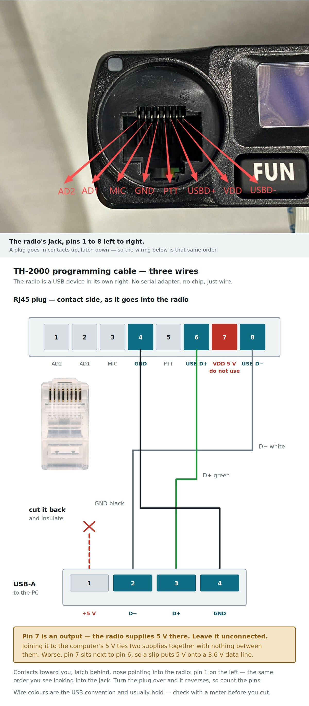

# Making a programming cable

The TH-2000 needs a USB cable with an RJ45 plug on the radio end. You can buy
one, but they are often unavailable, overpriced, or wired for a different
radio. Building one takes three wires.

**The most important thing on this page:** the radio puts **5 V on pin 7**.
That pin is an output. Do not connect it to anything.



*The photograph is of the radio's own accessory jack. The wiring diagram below
it is the same pin order, so the two can be read together.*

---

## What the radio is

This matters, because it is not what the label on most "programming cables"
would lead you to expect.

The accessory jack carries a **real USB connection**. The radio's own
microcontroller — an ARTERY AT32, USB `2E3C:8800` — implements USB CDC-ACM, so
the radio *is* the USB device. Your computer sees a virtual COM port.

There is no RS-232 and no USB-serial bridge chip. So:

* **You do not need a USB-to-serial adapter.** A cable with an FTDI, CH340 or
  Prolific chip in it is the wrong thing — it would put a second USB device
  between your computer and a radio that is already one.
* **The baud rate does not matter.** It becomes a USB request the firmware
  discards. This is why the manufacturer's own files disagree about it (57600
  in one place, 38400 in another) with no visible effect.
* A plain USB cable, cut and soldered to an RJ45 plug, is all that is needed.

---

## Pinout

Eight pins on the RJ45. The numbering is fixed; only which way round you see it
changes, so fix the orientation before you count:

* **Clip toward you**, cable running away from the plug's nose — the view in the
  diagram above — **pin 1 is on the left.**
* **Turn it over**, contacts toward you, and the order reverses.

Get this backwards and the cable is mirrored, so count carefully. In that first
orientation, left to right:

| Pin | Signal | Use it? |
|---|---|---|
| 1 | AD2 | no |
| 2 | AD1 | no |
| 3 | MIC | no |
| 4 | **GND** | **yes** |
| 5 | PTT | no |
| 6 | **USB D+** | **yes** |
| 7 | VDD (5 V out) | **no — leave it unconnected** |
| 8 | **USB D−** | **yes** |

The names come from the radio's own jack — see the photograph above.

Measured on a real radio, powered, nothing else connected:

```
pin 6  USB D+   3.27 V     the 1.5 kΩ pull-up of a full-speed USB device
pin 8  USB D−   0.99 V     floating; a meter's 10 MΩ input settles anywhere
pin 7  VDD      5.00 V     the radio sources this
```

The 3.27 V on D+ is the radio identifying itself as a USB device before
anything is plugged in. That pull-up is already there, which is part of why the
cable needs nothing but wire.

---

## Wiring

Cut a USB-A cable and use three of its four conductors. The colours below are
the USB standard and hold for most cables, but **check with a meter** — cheap
cables do not always follow it.

| USB wire | Colour (usual) | RJ45 pin |
|---|---|---|
| D+ | green | 6 |
| D− | white | 8 |
| GND | black | 4 |
| **+5 V** | **red** | **cut it back and insulate it** |

The red wire is the one that matters. Leave it long enough to grab and you will
eventually short it to something.

```
   USB-A plug                         RJ45 plug
   ┌─────────┐
   │ 1  +5V  │  ── cut, insulate, do not use
   │ 2  D−   │  ─────────────────────────────► pin 8
   │ 3  D+   │  ─────────────────────────────► pin 6
   │ 4  GND  │  ─────────────────────────────► pin 4
   └─────────┘
```

Shielded cable is not required for the length involved, but if your cable has a
braid, tie it to GND at the USB end only.

---

## Why the 5 V must not be connected

Pin 7 is an **output**. The radio is supplying 5 V from its own regulator,
presumably to power an accessory.

Your computer's USB port also supplies 5 V. Joining them ties two power
supplies together with no diode, no current limit and no agreement about which
one is in charge. What actually happens depends on which is higher and how each
reacts to being back-fed — possibilities run from nothing, through a hot
regulator, to damage at either end.

There is also a nastier failure. **Pin 7 sits next to pin 6, which is USB D+.**
A slip of the soldering iron, or a whisker of stray strand, puts 5 V onto a data
line. The microcontroller's USB transceiver is rated for about 3.6 V.

None of this is needed for anything. The radio is bus-powered by nothing — it
runs from its own supply — and the D+ pull-up that makes enumeration work is
already inside the radio.

**Three wires. Leave pin 7 alone.**

---

## Testing it

Before connecting to a radio, with the cable made and the RJ45 end in free air:

1. **Continuity**, USB plug to RJ45 pin, for each of the three wires.
2. **No continuity** between any pair of them — particularly D+ to GND.
3. **No continuity** from anything to pin 7.

Then plug the RJ45 into the radio, switch the radio on, and plug the USB into
your computer. You should get a new serial port:

* **Linux** — `dmesg | tail` shows `cdc_acm` claiming a device, and
  `/dev/ttyACM0` appears.
* **macOS** — `ls /dev/cu.*` shows a new `usbmodem` entry.
* **Windows** — Device Manager shows a new COM port. No driver is needed;
  Windows has a CDC-ACM class driver built in.

If nothing appears, check D+ and D− are not swapped. That is the usual fault
and it is harmless — USB simply does not enumerate.

Confirm with `lsusb` (Linux) or Device Manager details that it is
**`2E3C:8800`**. If you see an FTDI or CH340 id instead, you have an adapter in
the path that should not be there.

---

## If you buy one instead

Cables sold for the TYT TH-9800, TH-8890 and similar are usually the right
shape. Two things to check:

* It should be a **plain** cable. If the listing advertises an FTDI or Prolific
  chip, it is built for a radio with a real serial port and will not work here.
* Whether it connects pin 7 is rarely stated. If you are comfortable opening the
  moulding, check. If not, it is still safer than a home-made cable with the red
  wire left long.
